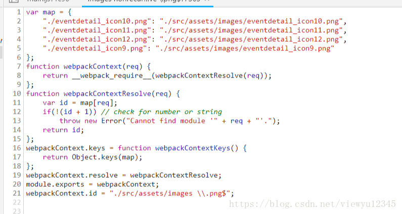

如果使用了Webpck进行了文件的组织、编译，就可以使用`require.context`令组件实现自动化注册。

这个过程需要在创建Vue实例之前（`new Vue({})`）之前完成，例如`src/main.js`

## require.context

Webpack解析带有表达式的require语句时，会创建一个上下文(context)，因为在编译时(compile time)并不清楚具体是哪一个模块被导入。

上下文模块还包含一些运行时(runtime)逻辑来访问这个 map 对象。

这意味着webpack能够支持动态require，但会导致所有可能用到的模块都包含在bundle中。

还可以使用equire.context()方法来创建自己的（模块）上下文。

你可以给这个方法传3个参数：要搜索的文件夹目录，是否还应该搜索它的子目录，以及一个匹配文件的正则表达式。

```
require.context(directory, useSubdirectories = false, regExp = /^\.\//);

```

实例：

```
require.context('./test', false, /\.test\.js$/);
// （创建了）一个包含了 test 文件夹（不包含子目录）下面的、所有文件名以 `.test.js` 结尾的、能被 require 请求到的文件的上下文。

require.context('../', true, /\.stories\.js$/);
// （创建了）一个包含了父级文件夹（包含子目录）下面，所有文件名以 `.stories.js` 结尾的文件的上下文。
```

传递给 require.context 的参数必须是字面量(literal)！

导出的上下文有是三个属性：

resolve是一个函数，它返回请求被解析后得到的模块id。
keys也是一个函数，它返回一个数组，由所有可能被上下文模块处理的请求组成
id是上下文模块里面所包含的模块id
用自己创建出的上下文，去引入要引入的文件，这是关键：
--------------------- 
```
const context = require.context('.', false, /.*\.(jpg|png)$/);
const images = context.keys().map(v => context(v));
```

## 利用require.context注册组件

在`main.js`中

```
const requireComponent = require.context(
  // 其组件目录的相对路径
  './components',
  // 是否查询其子目录
  false,
  // 匹配基础组件文件名的正则表达式
  /Base[A-Z]\w+\.(vue|js)$/
)


requireComponent.keys().forEach(fileName => {
  // 获取组件配置
  const componentConfig = requireComponent(fileName)

  // 获取组件的 PascalCase 命名
  const componentName = upperFirst(
    camelCase(
      // 剥去文件名开头的 `./` 和结尾的扩展名
      fileName.replace(/^\.\/(.*)\.\w+$/, '$1')
    )
  )

  // 全局注册组件
  Vue.component(
    componentName,
    // 如果这个组件选项是通过 `export default` 导出的，
    // 那么就会优先使用 `.default`，
    // 否则回退到使用模块的根。
    componentConfig.default || componentConfig
  )
})

```

## 动态注册路由

实现组件的自动注册后就可以实现路由的自动注册，在`router/index.js`中

```
import Vue from 'vue';
import Router from 'vue-router';

const requireComponent  = require.context('../components/demos', true, /demo[1-9][0-9]?\.vue$/);
const routes = requireComponent.keys().map(fileName => {
  // 获取组件配置
  const componentConfig = requireComponent(fileName);

  // 剥去文件名开头的 `./` 和结尾的扩展名
  const componentName = fileName.replace(/^\.\/(demo[1-9][0-9]?).*\.\w+$/, '$1');

  // 全局注册组件
  const component = Vue.component(
    componentName,
    // 如果这个组件选项是通过 `export default` 导出的，
    // 那么就会优先使用 `.default`，
    // 否则回退到使用模块的根。
    componentConfig.default || componentConfig
  );
  
  return {
    path: `/${componentName}` ,
    name: componentName,
    component,
  }
});

Vue.use(Router);

export default new Router({
  routes,
})

```

## 其他应用

还可以使用`require.context`实现一些其他目录的操作，例如读取目录下的图片：

```
<template>
  <div>
    
  </div>
</template>


<script>
  const context = require.context('.', false, /.*\.(jpg|png)$/);
  const images = context.keys().map(v => context(v));
  
  export default {
    data() {
      return {
        images,
      }
    }
  }
</script>

```



参考链接
--------------------- 


- [Vue组件的自动化全局注册](https://blog.csdn.net/duola8789/article/details/82887310)


- [Webpack](https://webpack.docschina.org/guides/dependency-management/)
- [Vue - 基础组件的自动化全局注册](https://cn.vuejs.org/v2/guide/components-registration.html)
- [掘金 - require.context](https://juejin.im/post/5ab8bcdb6fb9a028b77acdbd)
- [vue官方示例基础组件的自动化全局注册](https://cn.vuejs.org/v2/guide/components-registration.html#%E5%9F%BA%E7%A1%80%E7%BB%84%E4%BB%B6%E7%9A%84%E8%87%AA%E5%8A%A8%E5%8C%96%E5%85%A8%E5%B1%80%E6%B3%A8%E5%86%8C)